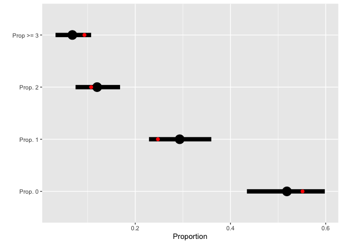

Testing for generality of pollinator recognition in *Heliconia*:
Analysis of aviary data
================
D.G. Gannon, A.S. Hadley, U.G. Kormann, F.A. Jones, M.G. Betts

### R packages

``` r
knitr::opts_chunk$set(echo = TRUE)

    require(tidyverse)
    require(here)
    require(rstan)
    require(loo)
```

### Load data

``` r
# Load data
  av <- read_csv(file = here("Data", "aviaries_data.csv"))
```

    ## Parsed with column specification:
    ## cols(
    ##   Flower_ID = col_double(),
    ##   Experiment = col_double(),
    ##   Species = col_character(),
    ##   Focal_Loc = col_character(),
    ##   Plant = col_character(),
    ##   Treatment = col_character(),
    ##   HP_time = col_double(),
    ##   PD_Loc = col_character(),
    ##   PD_plant = col_character(),
    ##   Bird = col_character(),
    ##   Date = col_double(),
    ##   Tube_Count = col_double()
    ## )

``` r
# Sort rows by species, then plant individual ID, then experiment ID
  av <- av[with(av, order(Species, Plant, Experiment)), ]
  
# Create factors for species, treatment, and plant individual
  av$f.species <- as.factor(av$Species)
  av$Treatment2 <- av$Treatment
  av$Treatment2[av$Treatment2 == "RTAH"] <- "SB"
  av$Treatment2[av$Treatment2 == "GREH"] <- "LB"
  
  av$f.trtmnt <- factor(av$Treatment2, levels = c("HP", "SB", "LB"))
  av$f.plant <- factor(av$Plant)
```

## Summary

To test whether pollen germination and tube growth is dependent on the
identity and morphology of a floral visitor, we conducted pollination
experiments with captive hummingbirds inside portable aviaries. In these
experiments, we randomly assigned flowers to one of three experimental
treatments: 1) hand-pollination only (HP treatment); 2) hand pollination
followed by a visit from a pollen-free rufous-tailed hummingbird (short,
straight bills; SB treatment); 3) hand pollination followed by a visit
from a pollen-free green hermit hummingbird (long, slightly decurved
bill; LB treatment).

This experiment follows a factorial design with factors for the plant
species and the treatment, but due to limited numbers of flowering
plants, we often conducted multiple experiments using flowers (the
experimental units) from the same plant. We therefore fitted the model
described below.

### Model

Let  be the number of pollen tubes scored in
the
 flower from the
 plant of species
 and  index
the treatment
(). We assume that ") for
. The model for the experiment can be written as

  
 = \\mu + \\alpha_i + \\beta_j + (\\alpha\\beta)_{ij} + \\gamma_{k(j)}
")  

where

  -  is the
    overall mean log-pollen tube rate,

  - , is the average deviation
    from the mean for flowers that received treatment
    ,

  - , is the average deviation
    from the mean for flowers of plant species
    ,

  - _{ij}, \\sum_{i=1}^3 (\\alpha\\beta)_{ij} = \\sum_{j=1}^4 (\\alpha\\beta)_{ij} = 0"),
    is the species\*treatment interaction effect,

  - } \\overset{iid}{\\sim} \\mathcal{N}(0, \\sigma_j^2)"),
    for each of  plants
    of species , is a
    random effect for the plant that is nested within species.

Because this model has an unconventional variance structure (random
effects have unique variances depending on the plant species), we fit
this model in a Bayesian framework. Furthermore, for ease of defining
the model in `rstan` (Carpenter et al. 2017), we reparameterized the
model to follow a regression parameterization with the reference level
being hand pollinated flowers of *Heliconia hirsuta*. The model
therefore reads

  
  

where  is a matrix of indicator variables indicating the species,
treatment, and plant individual for the
 observation,
.

#### Priors

We use weakly informative priors (priors designed in a such a way as to
be intentionally less-informative than a prior reflecting the
information actually available (Gelman 2006) for all regression
coefficients such that all are independent and normally distributed with
mean zero and standard deviation 1.5 (on the log scale). Importantly, a
standard deviation of 1.5 was chosen to constrain samplers to
biologically reasonable parameter space based on available literature
reporting pollen tube rates in Heliconia. Kress (1983) reports a
\~4.08-fold change (a regression coefficient of \~1.407), comparing
minimum and maximum pollen tube rates from nine species. Similarly,
(Pedersen and Kress 1999) report a \~4.00-fold increase in pollen tube
rates in H. paka when comparing flowers visited by honeyeaters to
cross-pollinations by hand, a \~60-fold increase comparing rates of
autogamous selfing to honeyeater pollination, and a 3.3-fold increase in
pollen tube rates in H. laufo when comparing autogamous selfing to
honeyeater pollination. Previous work in this system shows pollen tube
rates in H. tortuosa are maximized following visits from violet
sabrewing hummingbirds (Campyloterus hemileucurus), a \~5.7-fold
increase from ineffective pollinators (Betts, Hadley, and Kress 2015). A
") prior on regression coefficients on the log
scale reflects the presumption that most (95%) of the time, we will not
see fold-changes greater than \~20 when comparing pollen tube rates in
Heliconia. Thus, we think these priors are a good balance among being
conservative (concentrating some mass around zero such that signals in
the data need to be strong to suggest differences between treatments),
vague about prior information, and within the realm of biological
plausibility.

For the species-specific scale parameters, we define the priors
") for each . This structure allows us to account for
potential correlation among flowers from the same individual plant
without assuming all plant effects are i.i.d. random variables, but
instead that plant effects are i.i.d. within a species.

### Stan model code

``` stan

  data{
   
    int N;         //number of observations
    int K;         //number of regressions parameters
    int P;         //number of unique plants sampled (i.e. number of intercepts)
    int S;         //number of species in the analysis
    int pl[N];     //index for the plant in experiment i
    int sp[N];     //index for the plant species in experiment i
    int<lower=0> y[N];  //observations
    matrix[N,K] X;      //design matrix

  }
  
  parameters{
  
    vector[K] beta;            //vector of regression parameters
    real gamma_raw[P];         //individual plant effects before scaling
    real<lower=0> sigma[S];    //sd of plant effects, unique across species
  
  }
  
  transformed parameters{
  
    real<lower=0> lambda[N];  //rate parameter for the nth obs.

    for(n in 1:N){
      lambda[n] = exp(X[n,]*beta + gamma_raw[pl[n]]*sigma[sp[n]]);
    }
  
  }
  
  model{
  
    //priors
    for(k in 1:K){
      beta[k] ~ normal(0,1.5);
    }
    
    for(s in 1:S){
      sigma[s] ~ normal(0,1);
    }
    
    for(p in 1:P){
      gamma_raw[p] ~ normal(0,1);
    }
    
    //model
    for(n in 1:N){
      y[n] ~ poisson(lambda[n]);
    }
    
  }

  generated quantities{
  
    vector[N] loglik;     //log likelihood
    int y_rep[N];         //predicting new y with same linear predictor
    
    for(n in 1:N){
      loglik[n] = poisson_lpmf(y[n] | lambda[n]);
      y_rep[n] = poisson_rng(lambda[n]);
    }
  
  }
  
```

**Compile data**

``` r
# compile data to give to stan

# number of observations
  N <- dim(av)[1]
# response
  y <- av$Tube_Count
# design matrix  
  X <- model.matrix(~f.species*f.trtmnt,
                    data = av)
# number of regression parameters
  K <- dim(X)[2]
# integer vector indicating which plant was used
  pl <- as.integer(as.factor(av$Plant))
# integer vector indicating which species was tested
  sp <- as.integer(av$f.species)
# total number of plant species
  S <- length(unique(sp))
# total number of unique plants
  P <- length(unique(pl))

# compile data into named list  
  mod.data <- list(
                   N=N, K=K, S=S, P=P,
                   sp=sp, pl=pl,
                   y=y, X=X
                   )
```

**Fit the model**

``` r
# sample from the posterior defined by the stan model  
  mfit <- sampling(poisson_model, data=mod.data)  
  
# looic and other model assessments
  loglik <- extract_log_lik(mfit, "loglik", merge_chains = FALSE)
  
  reff <- relative_eff(exp(loglik))
  
  mfit_loo <- loo(loglik, r_eff = reff)

# save the model fit
  saveRDS(mfit, file = here("Data", "av_model_fit.rds"))
```

### A couple of posterior-predictive checks

``` r
# matrix of 4000 new, predicted datasets of the same length
y_preds <- as.data.frame(extract(mfit, pars="y_rep"))

# calculate proportion == i for each new dataset
draw_means <- map(0:2,
                  ~apply(y_preds, 1, function(v){mean(v == .x)}))
draw_means[[4]] <- apply(y_preds, 1, function(v){mean(v >= 3)})


# compute means and intervals across 4000 predictions
postpred <- tibble(
  cat = factor(c("Prop. 0", "Prop. 1",
          "Prop. 2", "Prop >= 3"),
          levels = c("Prop. 0", "Prop. 1",
          "Prop. 2", "Prop >= 3")),
  obs = c(mean(y == 0),
          mean(y==1),
          mean(y==2),
          mean(y >= 3)),
  pred = map_dbl(draw_means,
                 ~mean(.x)),
  low = map_dbl(draw_means,
                ~quantile(.x, probs = 0.025)),
  high = map_dbl(draw_means,
                 ~quantile(.x, probs = 0.975))
)

# posterior predictive plot
ggplot(data = postpred, aes(x=obs, y=cat))+
  geom_errorbarh(aes(xmin=low, xmax=high), height=0, size=3)+
  geom_point(aes(x=pred), size=6)+
  geom_point(size=2, color="red")+
  xlab("Proportion")+
  ylab("")
```

<!-- -->

**Figure 1**: Posterior predicted values and 95% credible intervals (in
black) for the proportion of observations equal to zero, one, and two,
and the proportion of observations greater than three in a new dataset
with the same  as
the observed data. Observed proportions are plotted in red. The model
tends to slightly over-predict the number of ones we expect to see in a
dataset of this size, predicting on average 10 more than what we
observed. However, all observed values are within the prediction
intervals, indicating a decent model fit.


-----

### References

<div id="refs" class="references">

<div id="ref-betts2015">

Betts, Matthew G., Adam S. Hadley, and W. John Kress. 2015. “Pollinator
Recognition by a Keystone Tropical Plant.” *Proceedings of the National
Academy of Sciences* 112 (11): 3433–8.
<https://doi.org/10.1073/pnas.1419522112>.

</div>

<div id="ref-carpenter2017">

Carpenter, Bob, Andrew Gelman, Matthew D. Hoffman, Daniel Lee, Ben
Goodrich, Michael Betancourt, Marcus Brubaker, Jiqiang Guo, Peter Li,
and Allen Riddell. 2017. “Stan: A Probabilistic Programming Language.”
*Journal of Statistical Software* 76 (1): 1–32.
<https://doi.org/10.18637/jss.v076.i01>.

</div>

<div id="ref-gelman2006">

Gelman, Andrew. 2006. “Prior Distributions for Variance Parameters in
Hierarchical Models (Comment on Article by Browne and Draper).”
*Bayesian Analysis* 1 (3): 515–34. <https://doi.org/10.1214/06-BA117A>.

</div>

<div id="ref-kress1983">

Kress, W. J. 1983. “Crossability Barriers in Neotropical Heliconia.”
*Annals of Botany* 52 (2): 131–47.

</div>

<div id="ref-pedersen1999">

Pedersen, Louise B., and W. John Kress. 1999. “Honeyeater (Meliphagidae)
Pollination and the Floral Biology of PolynesianHeliconia
(Heliconiaceae).” *Plant Systematics and Evolution* 216 (1): 1–21.
<https://doi.org/10.1007/BF00985098>.

</div>

</div>
