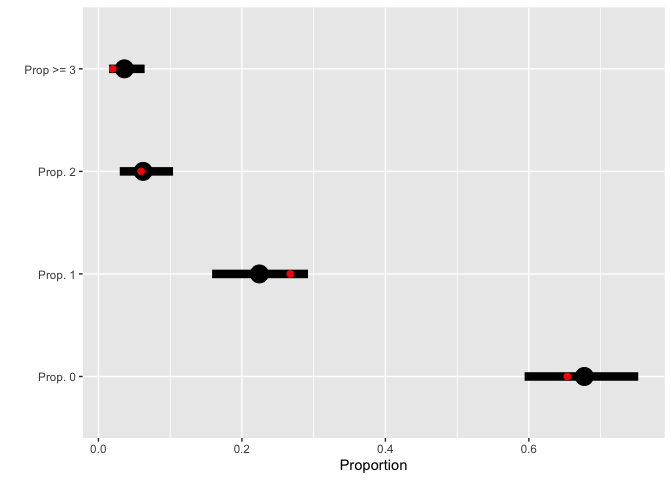

Testing for generality of pollinator recognition in *Heliconia* -
Testing for mechanisms
================
D. G. Gannon, A. S. Hadley, U. G. Kormann, F. A. Jones, and M. G. Betts

### R packages

``` r
knitr::opts_chunk$set(echo = TRUE)

  require(tidyverse)
  require(here)
  require(rstan)
  require(loo)
```

### Load and prepare data

``` r
# read in data
  nectar <- read_csv(file = here("Data", "nectar_experiments.csv"))
```

    ## Parsed with column specification:
    ## cols(
    ##   Flower_ID = col_double(),
    ##   Experiment = col_character(),
    ##   Species = col_character(),
    ##   Focal_Loc = col_character(),
    ##   Plant = col_character(),
    ##   Treatment = col_character(),
    ##   HP_time = col_double(),
    ##   PD_Loc = col_character(),
    ##   PD_plant = col_character(),
    ##   Date = col_double(),
    ##   Damage = col_character(),
    ##   Nectar_Out = col_double(),
    ##   Brix = col_character(),
    ##   Pollen_added_after_visit = col_double(),
    ##   Tube_Count = col_double()
    ## )

``` r
# remove hirsuta experiments (not enough)
  nectar <- nectar[-which(nectar$Species == "H.hirsuta"), ]
  
# remove cases in which liquid removed was not likely to be nectar
  nectar$Brix2 <- nectar$Brix
  nectar$Brix2[which(nectar$Brix2 == ">32")] <- "32" # replace entries of >32 with 32
  nectar <- nectar[-which(nectar$Brix2 < 14.1),]
  
  nectar$Nectar2 <- nectar$Nectar_Out
  nectar$Nectar2[which(is.na(nectar$Nectar2))] <- 0
  nectar <- nectar[-which(nectar$Nectar2 > 30 & nectar$Species!="H.rostrata"), ]

# create treatments for whether we pollinated before or after
  nectar$Treatment[which(nectar$Pollen_added_after_visit == 1)] <- "NEHP"
  
#create factors for species and treatment
  nectar$f.species <- factor(nectar$Species)
  nectar$f.trt <- factor(nectar$Treatment, levels = c("HP", "PM", "HPNE", "NEHP"))
```

## Summary

We analyze pollen tube data from nectar extraction experiments in a
similar way to how we analyzed the data from the aviary experiments (see
Appendix S2 for more details). In the data processing stage, we removed
observations from experiments in which our nectar removal experiments
were likely unsuccessful. We deemed experiments likely to be
unsuccessful if the liquid removed was a large volume of dilute liquid.
Based on previous experiments in which we attempted to remove nectar,
then destructively sampled flowers to check the remainder, large volumes
of dilute liquid usually indicated that we perforated the perianth with
the pipette tip and took up water from the bract. Furthermore, in an
independent dataset, the minimum Brix% measured was 14.1% (K.G.
Leimburger *unpublished data*), and the volume of nectar found in a
flower was rarely greater than 60
L for *H.
rostrata* and 30 for *H. tortuosa* and *H. wagneriana*. We therefore
removed observations for which the volume was greater than these
thresholds and/or the Brix% was below 14.1 before fitting the model.

We fit an identical model to these data as the model described in the
analysis of the [aviary
experiments](https://github.com/Dusty-Gannon/PR-in-Heliconia/blob/main/Analyses/PR_aviaries.md).
We refer the reader to the markdown document found
[here](https://github.com/Dusty-Gannon/PR-in-Heliconia/blob/main/Analyses/PR_aviaries.md)
for a model definition and prior justification. The Stan model code
below parallels the formal model definition.

``` stan

  data{
  
    int<lower=0> N;       //number of observations
    int<lower=0> K;       //number of covariates in regression model
    int<lower=0> P;       //number of individual plants used in experiments
    int<lower=0> S;       //number of species in the analysis
    
    int<lower=0> sp[N];   //index for the species
    int<lower=0> pl[N];   //index for the plant
    
    matrix[N,K] X;        //model matrix
    
    int<lower=0> y[N];    //pollen tube counts
  
  }
  
  
  parameters{
  
    vector[K] beta;             //regression parameters
    real gamma_raw[P];          //plant level effects
    real<lower=0> sigma[S];     //species-specific scale parameters for plant effects
  
  }
  
  
  transformed parameters{
  
    real<lower=0> lambda[N];       //means

    for(n in 1:N){
      lambda[n] = exp(X[n,]*beta + sigma[sp[n]]*gamma_raw[pl[n]]);
    }
    
  }
  
  
  model{
  
    //priors
    
    beta ~ normal(0,1.5);

    for(s in 1:S){
      sigma[s] ~ normal(0,1);
    }
    
    //model
    
    for(p in 1:P){
     gamma_raw[p] ~ normal(0,1);
    }
    
    for(n in 1:N){
      y[n] ~ poisson(lambda[n]);
    }
    
  }
  
  generated quantities{
  
    vector[N] loglik;      // log-likelihood
    vector[N] y_rep;       // predicted values for y based on observed X
    
    for(n in 1:N){
      loglik[n] = poisson_lpmf(y[n] | lambda[n]);
    }
    
    for(n in 1:N){
      y_rep[n] = poisson_rng(lambda[n]);
    }
  
  }
```

**Compile data**

``` r
# number of observations
  N <- dim(nectar)[1]
# model matrix
  X <- model.matrix(~f.trt*f.species, data = nectar)
# number of regression parameters
  K <- dim(X)[2]
# number of plant species
  S <- length(unique(nectar$Species))
# integer vector indicating the species
  sp <- as.integer(factor(nectar$Species))
# number of unique plants used
  P <- length(unique(nectar$Plant))
# indicator for the plant used
  pl <- as.integer(factor(nectar$Plant))
# response 
  y <- nectar$Tube_Count

# compile data into list  
  mod.data <- list(N=N, X=X, 
                   K=K, S=S, 
                   sp=sp, P=P, 
                   pl=pl, y=y)
```

**Fitting the model**

``` r
# sample from the posterior
  mfit <- sampling(poisson_reg, data=mod.data, 
                   control=list(adapt_delta=0.85))
```

``` r
# save the model fit
save(mfit, mod.data, 
     file = here("Data", "nectar_experiments_mfit.RData"))
```

**Model assessments using LOO-CV**

``` r
  loglik <- extract_log_lik(mfit, parameter_name = "loglik", merge_chains = FALSE)
  reff <- relative_eff(exp(loglik))
  
  modloo <- loo(loglik, r_eff = reff)
  
# check for influential observations
  odd.obs <- pareto_k_ids(modloo, threshold = 0.7)
  nectar[odd.obs,]
```

    ## # A tibble: 3 x 19
    ##   Flower_ID Experiment Species Focal_Loc Plant Treatment HP_time PD_Loc PD_plant
    ##       <dbl> <chr>      <chr>   <chr>     <chr> <chr>       <dbl> <chr>  <chr>   
    ## 1       553 17_058     H.wagn… Pino_Col… PC-W… HPNE          800 Garden G-WAG-01
    ## 2       455 205        H.wagn… Pino_Col… PC-W… HPNE          730 Garden G-WAG-03
    ## 3       439 197        H.wagn… Pino_Col… PC-W… HP            930 Pino_… PC-WAG-…
    ## # … with 10 more variables: Date <dbl>, Damage <chr>, Nectar_Out <dbl>,
    ## #   Brix <chr>, Pollen_added_after_visit <dbl>, Tube_Count <dbl>, Brix2 <chr>,
    ## #   Nectar2 <dbl>, f.species <fct>, f.trt <fct>


There are a few observations that are influential to the fit. We choose
*not* to remove these from the analysis because they are not incorrect,
but caution readers in their interpretations of the results of nectar
removal experiments with *H. wagneriana*.

#### Some posterior predictive checks

``` r
# matrix of 4000 new, predicted datasets of the same length
y_preds <- as.data.frame(extract(mfit, pars="y_rep"))

# calculate proportion == i for each new dataset
draw_means <- map(0:2,
                  ~apply(y_preds, 1, function(v){mean(v == .x)}))
draw_means[[4]] <- apply(y_preds, 1, function(v){mean(v >= 3)})

y <- mod.data[["y"]]
# compute means and intervals across 4000 predictions
postpred <- tibble(
  cat = factor(c("Prop. 0", "Prop. 1",
          "Prop. 2", "Prop >= 3"),
          levels = c("Prop. 0", "Prop. 1",
          "Prop. 2", "Prop >= 3")),
  obs = c(mean(y == 0),
          mean(y==1),
          mean(y==2),
          mean(y >= 3)),
  pred = map_dbl(draw_means,
                 ~mean(.x)),
  low = map_dbl(draw_means,
                ~quantile(.x, probs = 0.025)),
  high = map_dbl(draw_means,
                 ~quantile(.x, probs = 0.975))
)

# posterior predictive plot
ggplot(data = postpred, aes(x=obs, y=cat))+
  geom_errorbarh(aes(xmin=low, xmax=high), height=0, size=3)+
  geom_point(aes(x=pred), size=6)+
  geom_point(size=2, color="red")+
  xlab("Proportion")+
  ylab("")
```

<!-- -->

**Figure 1**: Posterior predicted values and 95% credible intervals (in
black) for the proportion of observations equal to zero, one, and two,
and the proportion of observations greater than three in a new dataset
with the same  as
the observed data. Observed proportions are plotted in red. All observed
values are within the prediction intervals, indicating a decent model
fit.
